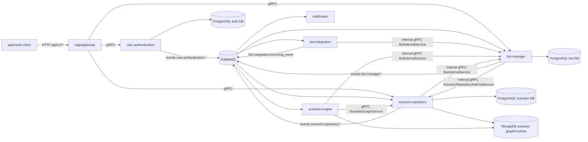

# Backend-сервисы

Frontend ходит только в `edge/gateway`. Gateway принимает HTTP JSON API `/api/v1/*`, проверяет JWT и синхронно вызывает backend по gRPC. Межсервисные команды, которым нужен немедленный ответ, тоже идут по gRPC. События состояния идут через RabbitMQ и не гарантируют мгновенную видимость в подписчиках.

`x-trace-id` проходит через HTTP, gRPC metadata и RabbitMQ headers. Код gateway: `edge/gateway/src/MazyPlatform.Service.Gateway/Interceptors`.

## Карта связей

## `edge/gateway`

Путь: `edge/gateway`.

Gateway публикует внешний backend API. Он делает gRPC JSON transcoding, Swagger, CORS, rate limiting, health checks и `/metrics`. Проксирует user, scenario и bot API в `authentication`, `scenario-repository`, `bot-manager`.

Синхронная граница: HTTP client -> gateway -> gRPC backend. Gateway не владеет доменными данными и не подписан на RabbitMQ.

Ломается при изменении:

- gRPC service/rpc names и HTTP annotations в `libraries/contracts/src/*/*.proto`;
- JWT secret или claims, которые gateway передает в metadata;
- адресов `Services__Authentication`, `Services__ScenarioRepository`, `Services__BotManager`;
- правил CORS, если frontend должен читать `x-trace-id`.

## `user-authentication`

Путь: `services/user/authentication`.

Сервис хранит пользователей, provider bindings, sessions, refresh/logout state, password flows, Email MFA и TOTP MFA. Постоянные данные лежат в PostgreSQL. Сервис вызывает Yandex provider при external login и публикует события для остальных сервисов.

Public gRPC:

- `RegistrationService`
- `AuthenticationService`
- `PasswordService`
- `MfaService`
- `MfaSessionService`
- `UserSessionService`
- `LinkedProviderService`

Async publish:

- `user.authentication.registered`
- `user.authentication.email-confirmed`
- `user.authentication.mfa-email-code-generated`
- `user.authentication.password-reset-requested`

Async consumers: нет.

Граница данных: другие сервисы не читают auth DB. Они получают факт создания или подтверждения пользователя через RabbitMQ.

Ломается при изменении:

- shape user events в `libraries/contracts/src/MazyPlatform.Contracts.User/Authentication/Events`;
- `Jwt__SecretKey`, если gateway и сервис расходятся;
- `TotpEncryption__Key`, если нужно читать ранее сохраненные TOTP secrets;
- provider redirect/client settings `ExternalProviders__Yandex__*`.

## `scenario-repository`

Путь: `services/scenario/repository`.

Сервис хранит проекты, entity schemas, draft graph, release versions, history и связи сценариев с пользователями. Metadata лежит в PostgreSQL. Graph/runtime documents лежат в MongoDB. Валидация графа использует `libraries/scenario`.

Public gRPC:

- `ProjectService`
- `EntitySchemaService`
- `ScenarioGraphService`
- `UserDataService`

Internal gRPC:

- `ScenarioRepositoryInternalService` для проверок из `bot-manager`.

Async consumers:

- `user.authentication.email-confirmed`

Async publish:

- `scenario.repository.project-deleted`
- `scenario.repository.scenario-release-changed`
- `scenario.repository.scenario-release-removed`
- `scenario.repository.scenario-version-deleted`

Sync dependencies: вызывает `BotInternalService` в `bot-manager`, когда операция должна знать, используются ли версии сценария ботами.

Граница данных: сервис владеет scenario metadata и graph documents. `scenario-engine` читает published graph через gRPC и Mongo-backed runtime abstractions, но не меняет draft/release lifecycle.

Ломается при изменении:

- node descriptors и validation rules в `libraries/scenario`;
- protobuf contracts `libraries/contracts/src/MazyPlatform.Contracts.Scenario.Grpc/Repository`;
- routing keys `scenario.repository.*`;
- internal token `InternalApi__AccessToken`;
- семантики release/version deletion, потому что `bot-manager` и `scenario-engine` реагируют на эти события.

## `scenario-engine`

Путь: `services/scenario/engine`.

Worker исполняет опубликованные сценарии. Он слушает входящие bot events и lifecycle events от `bot-manager`, держит локальное представление активных ботов, получает credentials через `BotInternalService`, читает graph через `ScenarioGraphService` и отправляет действия во внешние platform API.

Public HTTP/gRPC API: нет. Диагностические endpoints публикуются отдельным diagnostics host.

Async consumers:

- `bot.integration.incoming_event`
- `bot.manager.bot-instance-activated`
- `bot.manager.bot-instance-deactivated`
- `bot.manager.bot-instance-deleted`
- `bot.manager.bot-instance-token-changed`
- `bot.manager.bot-instance-unbound-from-project`
- `bot.manager.bot-instance-scenario-version-changed`

Sync dependencies:

- `BotInternalService` в `bot-manager`
- `ScenarioGraphService` в `scenario-repository`
- VK API

Граница данных: runtime state хранится в MongoDB. Истина о ботах остается в `bot-manager`, истина о сценариях - в `scenario-repository`.

Ломается при изменении:

- event shape `bot.integration.incoming_event` и `bot.manager.*`;
- node runtime contracts в `libraries/scenario`;
- credential API `BotInternalService`;
- `MongoDb__*`, `BotManager__*`, `ScenarioRepository__Address`, `DelayResume__*`.

## `bot-manager`

Путь: `services/bot/manager`.

Сервис хранит bot metadata, encrypted credentials, project binding, activation state и выбранную scenario version. PostgreSQL - источник истины. Перед binding/version operations синхронно проверяет проект и сценарий через `ScenarioRepositoryInternalService`.

Public gRPC:

- `BotService`

Internal gRPC:

- `BotInternalService` для workers и scenario repository.

Async consumers:

- `user.authentication.email-confirmed`
- `scenario.repository.project-deleted`
- `scenario.repository.scenario-release-changed`
- `scenario.repository.scenario-release-removed`

Async publish:

- `bot.manager.bot-instance-created`
- `bot.manager.bot-instance-activated`
- `bot.manager.bot-instance-deactivated`
- `bot.manager.bot-instance-deleted`
- `bot.manager.bot-instance-token-changed`
- `bot.manager.bot-instance-unbound-from-project`
- `bot.manager.bot-instance-scenario-version-changed`

Граница данных: только `bot-manager` пишет credentials и bot binding. `bot-integration` и `scenario-engine` получают credentials через internal gRPC.

Ломается при изменении:

- `BotTokenEncryption__Key`, если нужно читать ранее сохраненные credentials;
- `BotInternalService`, потому что его вызывают workers;
- events `bot.manager.*`, потому что они синхронизируют polling и execution;
- `ScenarioRepository__*` или internal token.

## `bot-integration`

Путь: `services/bot/integration`.

Worker слушает lifecycle events от `bot-manager`, синхронизирует активных ботов и делает polling VK/Telegram. Входящие provider updates публикует в RabbitMQ как `bot.integration.incoming_event`.

Public HTTP/gRPC API: нет. Диагностические endpoints публикуются отдельным diagnostics host.

Async consumers: lifecycle events `bot.manager.*`.

Async publish:

- `bot.integration.incoming_event`

Sync dependencies:

- `BotInternalService` в `bot-manager`
- VK API
- Telegram API

Граница данных: worker не владеет bot metadata. Он кеширует рабочее состояние polling и запрашивает credentials у `bot-manager`.

Ломается при изменении:

- lifecycle events `bot.manager.*`;
- provider settings `Vk__*`, `Telegram__*`;
- `BotInternalService`;
- routing key `bot.integration.incoming_event`, который слушает `scenario-engine`.

## `notification`

Путь: `services/notification`.

Worker отправляет email по событиям user authentication. Слушает RabbitMQ queue с binding `user.#`. Отправка зависит от SMTP/email provider settings.

Public HTTP/gRPC API: нет. Диагностические endpoints публикуются отдельным diagnostics host.

Async consumers:

- `user.authentication.registered`
- `user.authentication.mfa-email-code-generated`
- `user.authentication.password-reset-requested`

Async publish: нет.

Граница данных: сервис не хранит user state. Он читает payload события и вызывает email provider.

Ломается при изменении:

- user event payloads;
- RabbitMQ binding/routing keys `user.*`;
- `Email__Username`, `Email__Password`.
