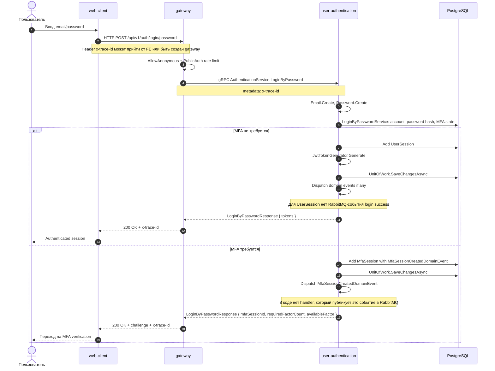

# Вход пользователя по паролю

## Назначение

Проверить email/password и создать пользовательскую session. Если у аккаунта включена MFA, сервис не выдает tokens сразу, а создает `MfaSession` и возвращает challenge.

## Источники истины

- `authentication.proto`: `POST /api/v1/auth/login/password`.
- `AuthenticationServiceProxy.LoginByPassword`: `[AllowAnonymous]`, rate limit `PublicAuth`.
- `LoginByPasswordHandler`: проверка email/password, создание session или MFA session.
- `UnitOfWork.SaveChangesAsync`: сохраняет EF-изменения, затем dispatch'ит доменные события агрегатов; для login password integration event в RabbitMQ не публикуется.

## Предусловия

- Gateway доступен на `:8080`.
- `user-authentication` подключен к PostgreSQL.
- Для успешного login email должен существовать, пароль должен пройти domain-проверку, email должен быть допустимым состоянием аккаунта.

## Участники

Пользователь, web-client, gateway, user-authentication, PostgreSQL.

## Диаграмма

## Транспорты

- HTTP: `web-client -> gateway`, `POST /api/v1/auth/login/password`.
- gRPC: `gateway -> user-authentication`, `AuthenticationService.LoginByPassword`.
- RabbitMQ: не используется в самом login. При MFA создается доменное событие `MfaSessionCreatedDomainEvent`, но integration event handler для него отсутствует. Email-код отправляется отдельным flow `mfa-email`.

## `x-trace-id`

Gateway принимает или создает `x-trace-id`, добавляет его в response header и передает в gRPC metadata. `user-authentication` кладет trace id в logging scope.

## Возможные ошибки

- невалидный формат email/password;
- неверные credentials;
- аккаунт не найден или не готов к login;
- MFA session id передан неверно;
- PostgreSQL недоступен.

## Локальная проверка

1. Запустить `.\tools\start.cmd`.
2. Открыть `http://localhost:5173/auth/login`.
3. Выполнить login.
4. Проверить `x-trace-id` в response и найти его в logs gateway/user-authentication.
