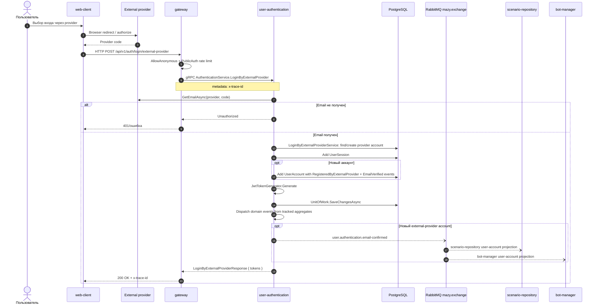

# Вход пользователя через provider

## Назначение

Войти через внешний provider. По текущей реализации user-authentication получает email у provider, выполняет `LoginByExternalProviderService`, создает session и при необходимости создает новый account. MFA в этом handler не запускается.

## Источники истины

- `authentication.proto`: `POST /api/v1/auth/login/external-provider`.
- `AuthenticationServiceProxy.LoginByExternalProvider`: `[AllowAnonymous]`, rate limit `PublicAuth`.
- `LoginByExternalProviderHandler`: `externalProviderService.GetEmailAsync`, создание session, optional new account.
- `UserAccount.CreateByExternalProvider`: для нового аккаунта добавляет `UserAccountRegisteredByExternalProviderDomainEvent` и `UserAccountEmailVerifiedDomainEvent`.
- `UserAccountEmailVerifiedHandler`: публикует `user.authentication.email-confirmed`; отдельного RabbitMQ-события "provider login success" нет.

## Предусловия

- Provider client id/secret/redirect URI настроены.
- Frontend получил provider `code`.
- `user-authentication` может обратиться к provider.

## Участники

Пользователь, web-client, external provider, gateway, user-authentication, PostgreSQL, RabbitMQ, scenario-repository, bot-manager.

## Диаграмма

## Транспорты

- HTTP/browser redirect: `web-client <-> external provider`.
- HTTP: `POST /api/v1/auth/login/external-provider`.
- gRPC: `AuthenticationService.LoginByExternalProvider`.
- RabbitMQ: для существующего аккаунта не используется. Для нового provider-аккаунта `UserAccountEmailVerifiedDomainEvent` приводит к `user.authentication.email-confirmed`.

## `x-trace-id`

Trace начинается на API-запросе frontend -> gateway. Redirect через provider не гарантирует сохранение header.

## Возможные ошибки

- provider code истек или неверен;
- provider не вернул email;
- неверная provider-конфигурация;
- аккаунт/provider link нарушает domain rules;
- PostgreSQL недоступен.

## Локальная проверка

1. Проверить наличие `ExternalProviders__Yandex__*` и `VITE_YANDEX_CLIENT_ID`.
2. Запустить web-client/gateway/authentication.
3. Выполнить provider login.
4. Проверить logs по `x-trace-id`.
