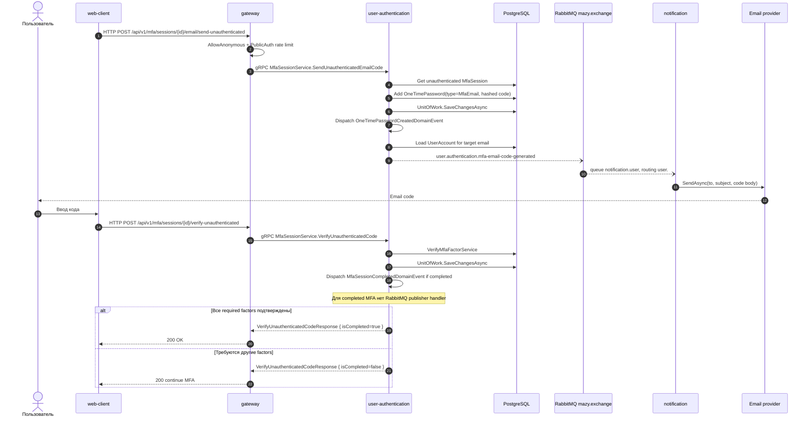

# Email MFA

## Назначение

Отправить email-код для MFA session и подтвердить factor. Для login используется unauthenticated ветка, потому что tokens еще не выданы. Для защищенных действий используется authenticated ветка.

## Источники истины

- `mfa_session.proto`: `/api/v1/mfa/sessions/*`.
- `MfaSessionServiceProxy`: authenticated `SendEmailCode/VerifyCode`, anonymous `SendUnauthenticatedEmailCode/VerifyUnauthenticatedCode`.
- `SendUnauthenticatedEmailCodeHandler`: создает `OneTimePassword` типа `MfaEmail`.
- `SendOtpOnOneTimePasswordCreatedHandler`: публикует `user.authentication.mfa-email-code-generated`.
- `OneTimePassword.Create`: добавляет `OneTimePasswordCreatedDomainEvent` с открытым кодом только внутри доменного события; в БД хранится hash.
- `UserAccountMfaEmailCodeGeneratedIntegrationEventHandler`: отправляет email.

## Предусловия

- `MfaSession` уже создан login/set-password/start flow.
- У пользователя есть email MFA factor или email доступен как MFA method.
- Notification service слушает `notification.user` (`user.#`).

## Участники

Пользователь, web-client, gateway, user-authentication, PostgreSQL, RabbitMQ, notification, email provider.

## Диаграмма

## Транспорты

- HTTP: `/api/v1/mfa/sessions/{mfa_session_id}/email/send-unauthenticated`, `/verify-unauthenticated`.
- gRPC: `MfaSessionService.SendUnauthenticatedEmailCode`, `VerifyUnauthenticatedCode`.
- RabbitMQ: `OneTimePasswordCreatedDomainEvent` -> `user.authentication.mfa-email-code-generated` -> `notification.user`.
- Email provider: `notification -> SMTP/API`.

## `x-trace-id`

Trace id проходит HTTP -> gRPC -> RabbitMQ headers -> notification logging scope. Запрос verify обычно отдельный и может иметь другой trace id.

## Возможные ошибки

- MFA session не найдена или не unauthenticated;
- OTP истек или неверен;
- RabbitMQ недоступен;
- notification consumer не активен;
- email provider недоступен.

## Локальная проверка

1. Получить MFA challenge через login password.
2. Вызвать send unauthenticated email code.
3. Проверить event `user.authentication.mfa-email-code-generated` и logs notification.
4. Ввести код и проверить `isCompleted`.
