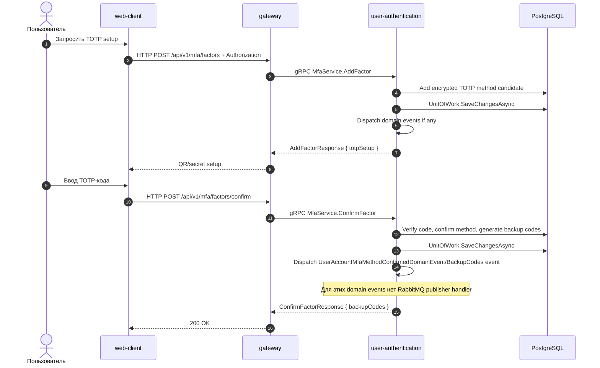

# TOTP MFA

## Назначение

Добавить TOTP factor, подтвердить его кодом authenticator-приложения и затем использовать этот factor в MFA sessions.

## Источники истины

- `mfa.proto`: `/api/v1/mfa/factors`, `/api/v1/mfa/factors/confirm`.
- `MfaServiceProxy`: все методы требуют `[Authorize]`.
- `AddTotpHandler`, `ConfirmTotpHandler`.
- `mfa_session.proto`: verify для использования TOTP во время MFA challenge.
- Изменения MFA factor сохраняются через `UnitOfWork`; relevant domain events не публикуются в RabbitMQ в текущей реализации.

## Предусловия

- Пользователь авторизован для настройки TOTP.
- `TotpEncryption__Key` корректен и постоянен для окружения.

## Участники

Пользователь, web-client, gateway, user-authentication, PostgreSQL.

## Диаграмма

## Транспорты

- HTTP: `/api/v1/mfa/factors`, `/api/v1/mfa/factors/confirm`.
- gRPC: `MfaService.AddFactor`, `MfaService.ConfirmFactor`.
- RabbitMQ: не используется.

## `x-trace-id`

Trace id проходит HTTP -> gateway -> gRPC -> user-authentication logs.

## Возможные ошибки

- JWT отсутствует или истек;
- TOTP secret не расшифровывается после смены `TotpEncryption__Key`;
- код не попал в verification window;
- factor уже есть или не найден;
- PostgreSQL недоступен.

## Локальная проверка

1. Авторизоваться.
2. Добавить TOTP factor.
3. Подтвердить код из authenticator-приложения.
4. Выполнить login и пройти TOTP через MFA session verify.
