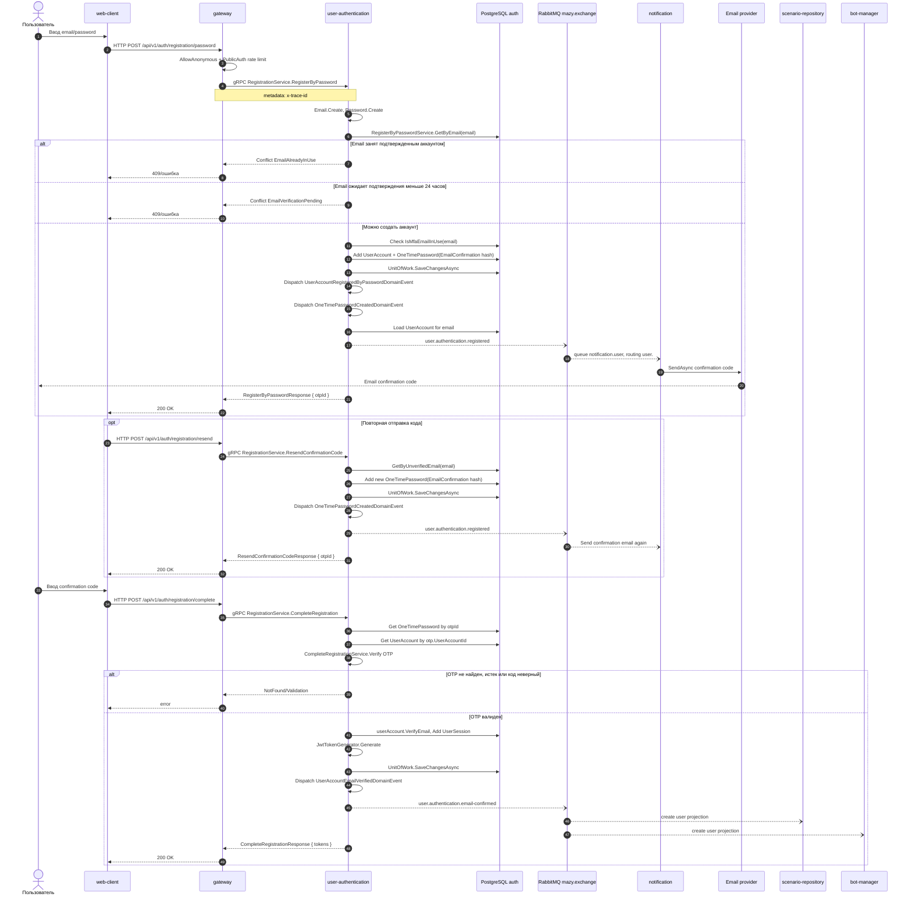

# Регистрация по паролю

## Назначение

Создать `UserAccount` с локальным password credential, создать OTP для подтверждения email, отправить код через notification service и завершить регистрацию с выдачей access/refresh tokens.

## Источники истины

- `registration.proto`: `POST /api/v1/auth/registration/password`, `/complete`, `/resend`.
- `RegistrationServiceProxy`: gateway проксирует `RegisterByPassword`, `CompleteRegistration`, `ResendConfirmationCode`.
- `RegisterByPasswordHandler`: валидирует `Email` и `Password`, вызывает `RegisterByPasswordService`, сохраняет `UserAccount` и `OneTimePassword`.
- `RegisterByPasswordService`: проверяет существующий аккаунт, pending verification, MFA email reuse, создает `UserAccount.RegisterByPassword` и `OneTimePassword(EmailConfirmation)`.
- `OneTimePassword.Create`: хэширует код и добавляет `OneTimePasswordCreatedDomainEvent` с открытым кодом для доставки.
- `SendOtpOnOneTimePasswordCreatedHandler`: для `OtpType.EmailConfirmation` публикует `user.authentication.registered`.
- `CompleteRegistrationHandler`: проверяет OTP, вызывает `CompleteRegistrationService`, добавляет `UserSession`, генерирует tokens.
- `UserAccountEmailVerifiedHandler`: публикует `user.authentication.email-confirmed`.

## Предусловия

- Email не занят подтвержденным аккаунтом.
- Если есть неподтвержденный аккаунт с тем же email, он либо младше 24 часов и registration вернет conflict, либо старше 24 часов и будет удален доменным сервисом.
- Email не используется как MFA email другого аккаунта.
- RabbitMQ и notification доступны для доставки confirmation code.

## Участники

Пользователь, web-client, gateway, user-authentication, PostgreSQL auth, RabbitMQ, notification, email provider, scenario-repository, bot-manager.

## Диаграмма

## Транспорты

- HTTP: `/api/v1/auth/registration/password`, `/api/v1/auth/registration/resend`, `/api/v1/auth/registration/complete`.
- gRPC: `RegistrationService.RegisterByPassword`, `ResendConfirmationCode`, `CompleteRegistration`.
- RabbitMQ: `OneTimePasswordCreatedDomainEvent(EmailConfirmation)` -> `user.authentication.registered`; `UserAccountEmailVerifiedDomainEvent` -> `user.authentication.email-confirmed`.
- Email provider: `notification -> SMTP/API`.

## `x-trace-id`

Trace id проходит HTTP -> gateway -> gRPC -> user-authentication logs -> RabbitMQ headers -> notification/scenario-repository/bot-manager logs. Registration, resend и complete могут быть разными HTTP-запросами и иметь разные trace id.

## Возможные ошибки

- невалидный email или password;
- email уже занят подтвержденным аккаунтом;
- email уже ожидает подтверждения;
- email используется как MFA email другого аккаунта;
- OTP не найден, истек или код неверный;
- PostgreSQL/RabbitMQ/email provider недоступны;
- downstream consumers `email-confirmed` могут упасть и отправить сообщение в DLQ.

## Локальная проверка

1. Запустить dev compose.
2. Отправить registration request.
3. Проверить `otpId` в response и событие `user.authentication.registered`.
4. Проверить logs notification и письмо/SMTP sink.
5. Завершить регистрацию через `/complete`.
6. Проверить tokens в response и событие `user.authentication.email-confirmed`.
