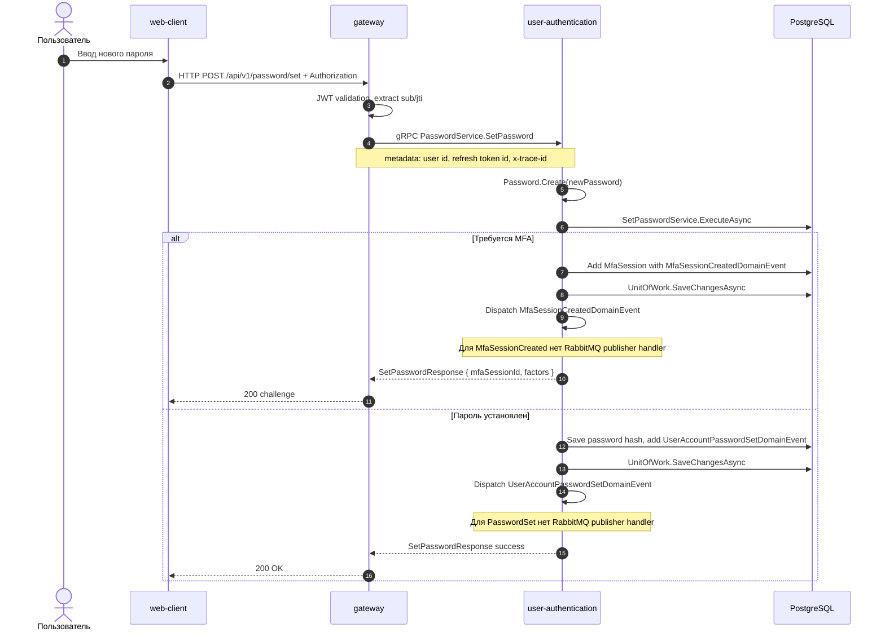

# Установка пароля для provider-пользователя

## Назначение

Добавить локальный password credential аккаунту, который ранее входил через external provider. Endpoint защищен JWT. Если domain-service требует MFA, сначала возвращается MFA challenge; повторный вызов передает `mfaSessionId`.

## Источники истины

- `password.proto`: `POST /api/v1/password/set`.
- `PasswordServiceProxy.SetPassword`: наследует `[Authorize]`, без `[AllowAnonymous]`.
- `SetPasswordHandler`: `SetPasswordService.ExecuteAsync(userAccountId, newPassword, mfaSessionId)`.
- `UserAccount.SetPassword`: добавляет `UserAccountPasswordSetDomainEvent`, но в application слое нет handler, который публикует его в RabbitMQ.

## Предусловия

- Пользователь уже авторизован.
- У аккаунта есть provider login и еще нет локального password или domain rules разрешают установку.

## Участники

Пользователь, web-client, gateway, user-authentication, PostgreSQL.

## Диаграмма

## Транспорты

- HTTP: `POST /api/v1/password/set`.
- gRPC: `PasswordService.SetPassword`.
- RabbitMQ: не используется в текущей реализации. Доменные события `MfaSessionCreatedDomainEvent` и `UserAccountPasswordSetDomainEvent` сохраняются/dispatch'ятся, но не имеют integration publisher handler.

## `x-trace-id`

Gateway прокидывает trace id в gRPC metadata. Повторный запрос после MFA может иметь новый trace id, если frontend его не сохраняет.

## Возможные ошибки

- отсутствует/истек JWT;
- пароль не проходит value object validation;
- MFA session неверна или не завершена;
- password уже установлен или domain state запрещает операцию;
- PostgreSQL недоступен.

## Локальная проверка

1. Войти через provider.
2. Открыть настройки пароля.
3. Выполнить `set password`.
4. Если вернулся challenge, завершить MFA и повторить set password с `mfaSessionId`.
