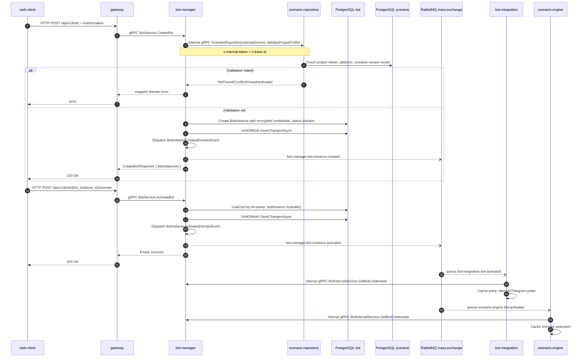

# Подключение бота

## Назначение

Создать bot instance с credentials, привязать его к проекту/версии сценария и активировать. Только activation запускает polling в `bot-integration` и добавляет бота в cache `scenario-engine`.

## Источники истины

- `bot_service.proto`: `POST /api/v1/bots`, `POST /api/v1/bots/{bot_instance_id}/activate`.
- `BotGrpcService.CreateBot`, `ActivateBot`.
- `CreateBotHandler`: internal validation project/version через scenario-repository.
- `ActivateBotHandler`: `botInstance.Activate`.
- `BotInstance.Create`: добавляет `BotInstanceCreatedDomainEvent`; `BotInstance.Activate`: добавляет `BotInstanceActivatedDomainEvent`.
- `BotInstanceActivatedDomainEventHandler`: publishes `bot.manager.bot-instance-activated`.
- `BotInstanceActivatedIntegrationEventHandler` в bot-integration/scenario-engine.

## Предусловия

- Пользователь авторизован.
- Проект существует и принадлежит пользователю.
- У проекта есть версия сценария, выбранная для бота.
- Platform проекта совместима с platform бота.

## Участники

web-client, gateway, bot-manager, scenario-repository, PostgreSQL, RabbitMQ, bot-integration, scenario-engine.

## Диаграмма

## Транспорты

- HTTP: `POST /api/v1/bots`, `POST /api/v1/bots/{bot_instance_id}/activate`.
- gRPC: `BotService.CreateBot`, `BotService.ActivateBot`, internal `ScenarioRepositoryInternalService.ValidateProjectForBot`, internal `BotInternalService.GetBotCredentials`.
- RabbitMQ: `BotInstanceCreatedDomainEvent` -> `bot.manager.bot-instance-created`; `BotInstanceActivatedDomainEvent` -> `bot.manager.bot-instance-activated`.

## `x-trace-id`

Trace id проходит HTTP -> gateway -> bot-manager. Bot-manager добавляет его в internal gRPC metadata и RabbitMQ message headers. Consumers сохраняют trace id в logging scope.

## Возможные ошибки

- JWT отсутствует или невалиден;
- project/version не найдены;
- platform mismatch между project и bot;
- credentials невалидны для domain value object;
- bot уже активирован или не готов к activation;
- bot-integration/scenario-engine не смогли получить credentials.

## Локальная проверка

1. Создать project и publish release.
2. Создать bot через UI/API.
3. Активировать bot.
4. Проверить events `bot.manager.bot-instance-created` и `bot.manager.bot-instance-activated`.
5. Проверить logs bot-integration: poller started; scenario-engine: bot cached.
