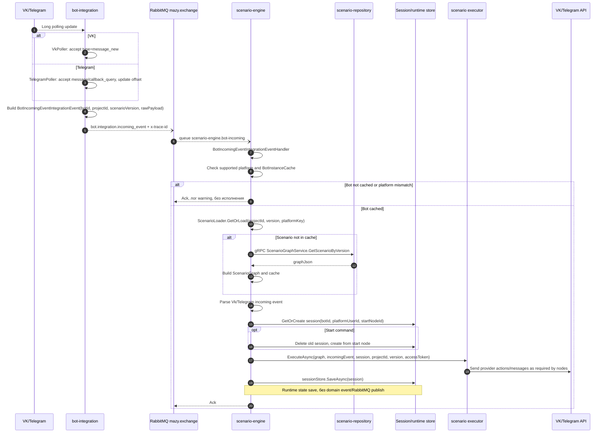

# Входящее сообщение от бота

## Назначение

Получить update из VK/Telegram, нормализовать его в `BotIncomingEventIntegrationEvent`, передать в scenario-engine через RabbitMQ, загрузить scenario graph при cache miss, получить/создать session и выполнить сценарий.

## Источники истины

- `VkPoller`, `TelegramPoller`: polling provider API и publish `BotIncomingEventIntegrationEvent`.
- `RabbitMqEventPublisher`: routing key `bot.integration.incoming_event`.
- `BotIncomingEventIntegrationEventHandler`: cache lookup, parse incoming event, load scenario, session, executor.
- `ScenarioLoader`: cache -> `ScenarioGraphService.GetScenarioByVersion`.
- В этом flow нет EF `UnitOfWork` и доменных событий: bot-integration публикует integration event напрямую из poller, scenario-engine сохраняет runtime session через `sessionStore.SaveAsync`.

## Предусловия

- Бот активен.
- bot-integration и scenario-engine уже получили `bot.manager.bot-instance-activated` или initial sync.
- Bot cache содержит `botId -> projectId/scenarioVersion/platform/accessToken`.
- Release version существует в scenario-repository.

## Участники

VK/Telegram, bot-integration, RabbitMQ, scenario-engine, scenario-repository, Mongo/session store, provider API.

## Диаграмма

## Транспорты

- Provider API: VK long poll или Telegram getUpdates.
- RabbitMQ: `bot.integration.incoming_event` публикуется напрямую из `VkPoller`/`TelegramPoller`; scenario-engine на успешное исполнение новых RabbitMQ-событий не публикует.
- gRPC: `ScenarioGraphService.GetScenarioByVersion` только если scenario cache miss.
- Provider API: outgoing actions из executor.

## `x-trace-id`

Provider update обычно не содержит trace id, поэтому bot-integration создает новый через `TraceContext.GetOrCreate()` при publish. Scenario-engine читает header из RabbitMQ и использует его при logs и gRPC cache miss.

## Возможные ошибки

- provider polling error/timeout;
- publish в RabbitMQ failed;
- bot отсутствует в cache;
- platform mismatch;
- scenario version не найдена;
- raw payload не парсится;
- session store недоступен;
- provider API отклонил outgoing action.

## Локальная проверка

1. Активировать бота и убедиться, что poller запущен.
2. Отправить сообщение боту.
3. Проверить publish `bot.integration.incoming_event`.
4. Проверить logs scenario-engine по trace id.
5. Проверить outgoing response во внешней платформе.
