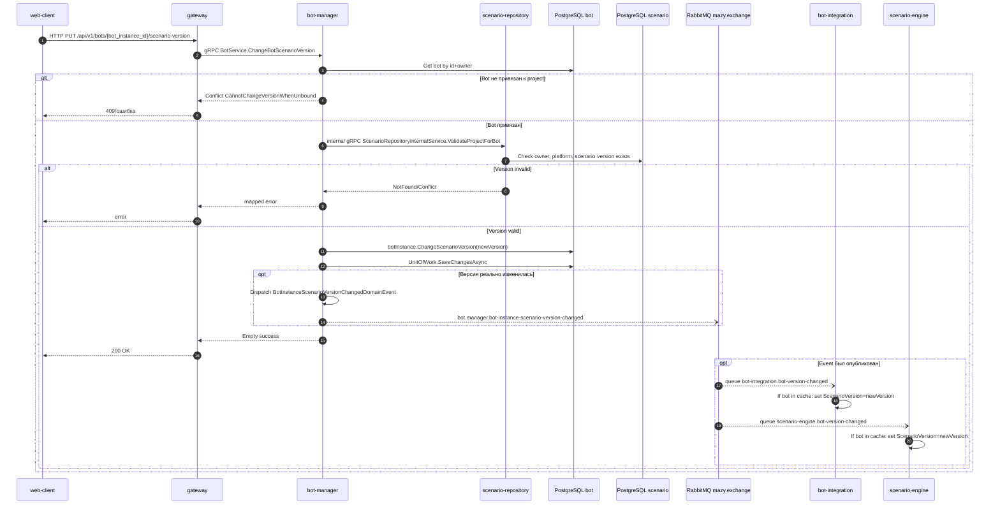

# Переключение версии сценария для бота

## Назначение

Изменить `ScenarioVersion` у bot instance. Bot-manager валидирует новую версию в scenario-repository, сохраняет изменение и публикует event. Consumers обновляют local cache без повторного запроса credentials.

## Источники истины

- `bot_service.proto`: `PUT /api/v1/bots/{bot_instance_id}/scenario-version`.
- `ChangeBotScenarioVersionHandler`: проверка ownership, project binding, internal validation project/version, domain change.
- `BotInstance.ChangeScenarioVersion`: добавляет `BotInstanceScenarioVersionChangedDomainEvent`, если версия реально изменилась; если новая версия равна текущей, метод возвращает success без события.
- `BotInstanceScenarioVersionChangedDomainEventHandler`: publishes `bot.manager.bot-instance-scenario-version-changed`.
- `BotInstanceScenarioVersionChangedIntegrationEventHandler` в bot-integration/scenario-engine: update cache only.

## Предусловия

- Пользователь авторизован.
- Бот принадлежит пользователю.
- Бот привязан к project.
- Новая version существует и совместима с platform проекта.

## Участники

web-client, gateway, bot-manager, scenario-repository, PostgreSQL, RabbitMQ, bot-integration, scenario-engine.

## Диаграмма

## Транспорты

- HTTP: `PUT /api/v1/bots/{bot_instance_id}/scenario-version`.
- gRPC: `BotService.ChangeBotScenarioVersion`, internal `ScenarioRepositoryInternalService.ValidateProjectForBot`.
- RabbitMQ: `BotInstanceScenarioVersionChangedDomainEvent` -> `bot.manager.bot-instance-scenario-version-changed`; если версия не изменилась, события нет.

## `x-trace-id`

Trace id идет HTTP -> gRPC -> internal gRPC -> RabbitMQ. Consumers используют его в message handling logs.

## Возможные ошибки

- bot не найден или принадлежит другому пользователю;
- bot не привязан к project;
- новая version не найдена;
- platform mismatch;
- internal token scenario-repository неверен;
- RabbitMQ publish failed.

## Локальная проверка

1. Опубликовать две версии сценария.
2. Активировать бота на первой версии.
3. Переключить на вторую версию.
4. Проверить event `bot.manager.bot-instance-scenario-version-changed`.
5. Проверить logs bot-integration/scenario-engine: cache version updated.
