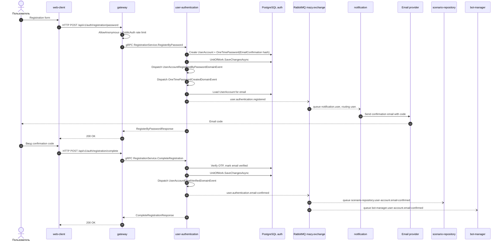

# Подтверждение email

## Назначение

Отправить код подтверждения регистрации и завершить подтверждение email. Notification отправляет письмо только по `user.authentication.registered`; после успешного подтверждения user-authentication публикует `user.authentication.email-confirmed` для других сервисов.

## Источники истины

- `registration.proto`: `POST /api/v1/auth/registration/password`, `/complete`, `/resend`.
- `RegisterByPasswordHandler`: создает account и OTP email confirmation.
- `SendOtpOnOneTimePasswordCreatedHandler`: publishes `user.authentication.registered`.
- `UserAccountRegisteredIntegrationEventHandler`: sends email.
- `CompleteRegistrationHandler` + `UserAccountEmailVerifiedHandler`: publishes `user.authentication.email-confirmed`.
- `UnitOfWork.SaveChangesAsync`: после сохранения достает domain events из `UserAccount` и `OneTimePassword`; именно `OneTimePasswordCreatedDomainEvent` запускает письмо с кодом.

## Предусловия

- Email еще не зарегистрирован.
- RabbitMQ и notification запущены.
- Email provider credentials настроены.

## Участники

Пользователь, web-client, gateway, user-authentication, PostgreSQL, RabbitMQ, notification, email provider, scenario-repository, bot-manager.

## Диаграмма

## Транспорты

- HTTP: `/api/v1/auth/registration/password`, `/api/v1/auth/registration/complete`.
- gRPC: `RegistrationService.RegisterByPassword`, `CompleteRegistration`.
- RabbitMQ: `OneTimePasswordCreatedDomainEvent(EmailConfirmation)` -> `user.authentication.registered`; `UserAccountEmailVerifiedDomainEvent` -> `user.authentication.email-confirmed`.
- Email provider: notification -> SMTP/API.

## `x-trace-id`

Registration request trace id попадает в `user.authentication.registered`. Complete request может иметь другой trace id и попадает в `user.authentication.email-confirmed`.

## Возможные ошибки

- email уже занят;
- password невалиден;
- confirmation code истек или неверен;
- RabbitMQ publish failed;
- notification не может отправить email;
- downstream consumers email-confirmed упали и сообщение ушло в DLQ.

## Локальная проверка

1. Зарегистрировать пользователя.
2. Проверить event `user.authentication.registered`.
3. Проверить logs notification.
4. Завершить регистрацию.
5. Проверить event `user.authentication.email-confirmed` и consumers scenario-repository/bot-manager.
