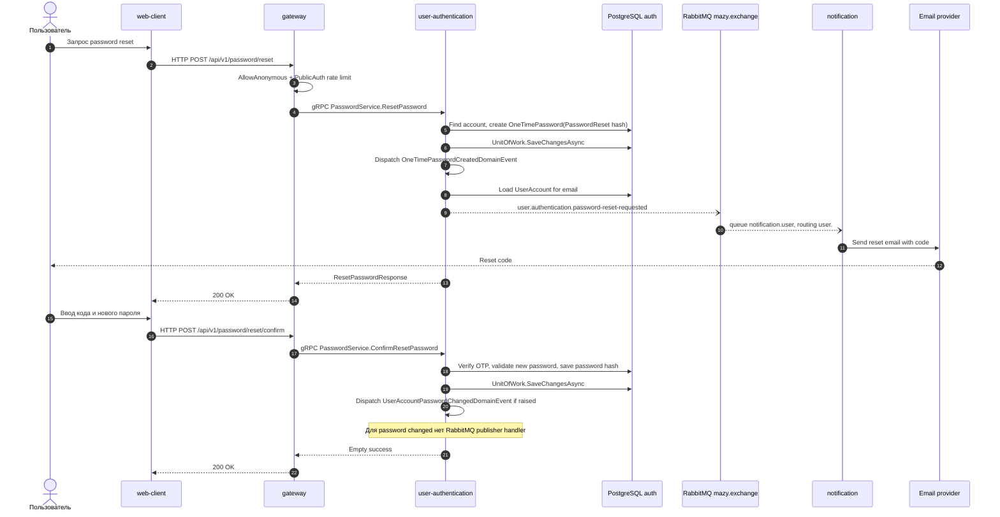

# Сброс пароля

## Назначение

Создать OTP для сброса пароля, отправить код по email и затем установить новый password hash после подтверждения кода.

## Источники истины

- `password.proto`: `POST /api/v1/password/reset`, `/reset/confirm`.
- `PasswordServiceProxy.ResetPassword` и `ConfirmResetPassword`: `[AllowAnonymous]`, rate limit `PublicAuth`.
- `ResetPasswordHandler`: создает password reset OTP.
- `SendOtpOnOneTimePasswordCreatedHandler`: publishes `user.authentication.password-reset-requested`.
- `UserAccountPasswordResetRequestedIntegrationEventHandler`: sends email.
- `ConfirmResetPasswordHandler`: проверяет OTP и меняет password.
- `UnitOfWork.SaveChangesAsync`: `OneTimePasswordCreatedDomainEvent` появляется при создании OTP и уже после сохранения приводит к RabbitMQ publish.

## Предусловия

- Аккаунт с email существует и может сбрасывать пароль.
- RabbitMQ и notification запущены.
- Email provider доступен.

## Участники

Пользователь, web-client, gateway, user-authentication, PostgreSQL, RabbitMQ, notification, email provider.

## Диаграмма

## Транспорты

- HTTP: `/api/v1/password/reset`, `/api/v1/password/reset/confirm`.
- gRPC: `PasswordService.ResetPassword`, `ConfirmResetPassword`.
- RabbitMQ: `OneTimePasswordCreatedDomainEvent(PasswordReset)` -> `user.authentication.password-reset-requested`. Confirm reset в RabbitMQ не публикует событие.
- Email provider: notification -> SMTP/API.

## `x-trace-id`

Reset request trace id идет в RabbitMQ event. Confirm request обычно отдельный и может иметь другой trace id.

## Возможные ошибки

- email не найден или account state запрещает reset;
- OTP истек или неверен;
- новый пароль невалиден;
- RabbitMQ publish failed;
- notification/email provider failed;
- PostgreSQL недоступен.

## Локальная проверка

1. На экране reset password запросить код.
2. Проверить event `user.authentication.password-reset-requested`.
3. Проверить logs notification.
4. Подтвердить reset кодом и новым паролем.
5. Войти новым паролем.
