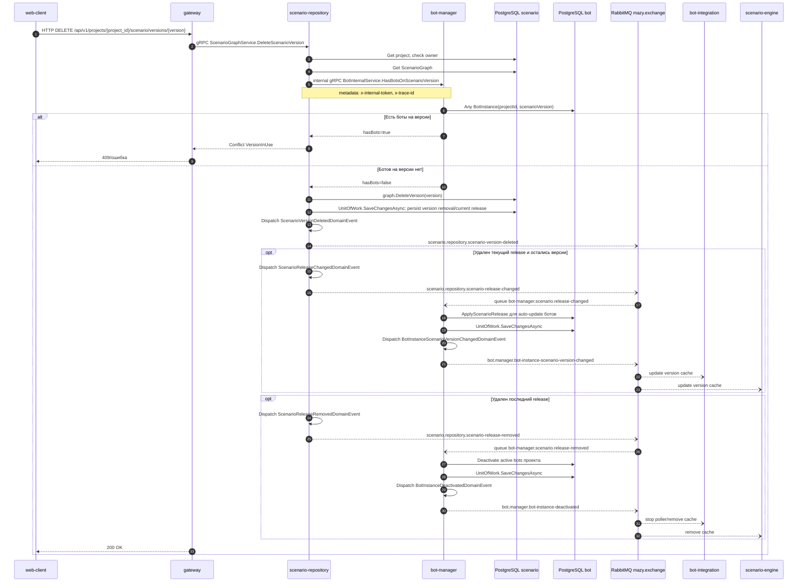

# Удаление версии сценария

## Назначение

Удалить опубликованную версию сценария, если на нее не ссылаются боты. Если удаляется текущий release, domain выбирает максимальную оставшуюся версию как новый release или сбрасывает release, если версий больше нет.

## Источники истины

- `scenario_repository.proto`: `DELETE /api/v1/projects/{project_id}/scenario/versions/{version}`.
- `DeleteScenarioVersionHandler`: project access, internal bot check, `graph.DeleteVersion`.
- `BotInternalService.HasBotsOnScenarioVersion`: internal bot-manager query.
- `ScenarioGraph.DeleteVersion`: domain events `ScenarioVersionDeleted`, optional `ScenarioReleaseChanged` или `ScenarioReleaseRemoved`.
- `UnitOfWork.SaveChangesAsync`: сохраняет удаление версии, затем dispatch'ит все domain events, которые `ScenarioGraph.DeleteVersion` добавил в агрегат.

## Предусловия

- Пользователь авторизован.
- Проект принадлежит пользователю.
- Версия существует.
- Нет bot instances с `ProjectId` и `ScenarioVersion`, равными удаляемой версии.

## Участники

web-client, gateway, scenario-repository, bot-manager, PostgreSQL, RabbitMQ, bot-integration, scenario-engine.

## Диаграмма

## Транспорты

- HTTP: `DELETE /api/v1/projects/{project_id}/scenario/versions/{version}`.
- gRPC: public `ScenarioGraphService.DeleteScenarioVersion`, internal `BotInternalService.HasBotsOnScenarioVersion`.
- RabbitMQ: `ScenarioVersionDeletedDomainEvent` -> `scenario.repository.scenario-version-deleted`; если удален текущий release, дополнительно `ScenarioReleaseChangedDomainEvent` -> `scenario.repository.scenario-release-changed` или `ScenarioReleaseRemovedDomainEvent` -> `scenario.repository.scenario-release-removed`.

## `x-trace-id`

Gateway прокидывает trace id в scenario-repository. Scenario-repository добавляет его в internal gRPC metadata и RabbitMQ headers.

## Возможные ошибки

- версия не найдена;
- проект не найден или нет доступа;
- версия используется ботами;
- internal token к bot-manager неверен;
- PostgreSQL/RabbitMQ недоступны;
- downstream consumers обработают событие с ошибкой и сообщение уйдет в DLQ.

## Локальная проверка

1. Опубликовать две версии.
2. Проверить, что удаляемая версия не выбрана ботом.
3. Удалить версию.
4. Проверить history и RabbitMQ events.
5. Если удаляли текущую версию, проверить cache update у bot-integration/scenario-engine.
