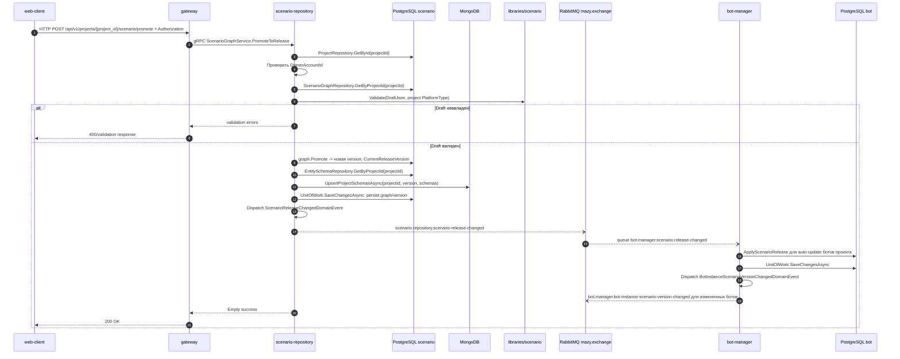

# Публикация сценария в release

## Назначение

Проверить draft, создать новую release-версию в `ScenarioGraph`, сохранить snapshot схем пользовательских данных для runtime и опубликовать событие изменения release.

## Источники истины

- `scenario_repository.proto`: `POST /api/v1/projects/{project_id}/scenario/promote`.
- `PromoteToReleaseHandler`: project access, scenario validation, `graph.Promote`, `runtimeSchemaSnapshotStore.UpsertProjectSchemasAsync`.
- `ScenarioGraph.Promote`: добавляет `ScenarioReleaseChangedDomainEvent`.
- `ScenarioReleaseChangedDomainEventHandler`: публикует `scenario.repository.scenario-release-changed`.
- `UnitOfWork.SaveChangesAsync`: сначала сохраняет `ScenarioGraph` в PostgreSQL, затем dispatch'ит `ScenarioReleaseChangedDomainEvent`; publisher берет routing key из contracts-атрибута и передает его в `BasicPublish`.

## Предусловия

- Пользователь авторизован.
- Проект принадлежит пользователю.
- Draft валиден для platform type проекта.

## Участники

web-client, gateway, scenario-repository, PostgreSQL scenario, MongoDB, `libraries/scenario`, RabbitMQ, bot-manager, PostgreSQL bot.

## Диаграмма

## Транспорты

- HTTP: `POST /api/v1/projects/{project_id}/scenario/promote`.
- gRPC: `ScenarioGraphService.PromoteToRelease`.
- RabbitMQ: `ScenarioReleaseChangedDomainEvent` -> `scenario.repository.scenario-release-changed`; в bot-manager auto-update может породить `bot.manager.bot-instance-scenario-version-changed`.
- MongoDB: runtime schema snapshot, не хранение самого graph release.

## `x-trace-id`

Trace id идет HTTP -> gRPC -> RabbitMQ headers. Bot-manager consumer читает trace id из message headers и пишет его в logs.

## Возможные ошибки

- проект не найден или нет доступа;
- graph не найден;
- validation failed;
- runtime schema snapshot в MongoDB не сохранился;
- PostgreSQL/RabbitMQ недоступны;
- bot-manager consumer может позже упасть и отправить сообщение в DLQ.

## Локальная проверка

1. Создать валидный draft.
2. Опубликовать release.
3. Проверить version history.
4. В RabbitMQ/logs проверить `scenario.repository.scenario-release-changed`.
5. Если есть auto-update боты, проверить events `bot.manager.bot-instance-scenario-version-changed`.
